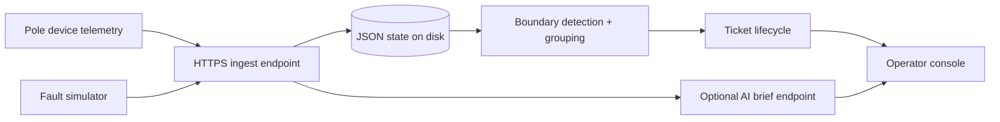

# Architecture

## System flow

## Data sourcing and ingestion

The stack uses a seedable synthetic subdivision generated from the schemas in `02-data-and-systems.md`. Telemetry is accepted on `POST /api/telemetry` and also generated by the simulator. I keep ingestion simple and deterministic: a single process, JSON persistence, and one canonical observation per pole.

Duplicate handling is per pole and sequence number. Older messages are ignored, same-sequence duplicates increment duplicate metrics, and newer observations overwrite the current pole state. That is enough for the assignment because the important correctness problem is the outage boundary, not distributed ingestion.

Clock skew and out-of-order delivery are tolerated by never trusting timestamps alone. Sequence number is the ordering source within a device; across devices I only use the most recent accepted observation for the pole.

## Storage and internal model

The network is stored as:

- `feeders`: feeder ids and their DTs
- `dts`: transformer records with `topology_known`
- `poles`: pole registry plus latest observation state
- `observations`: latest accepted telemetry per pole
- `tickets`: lifecycle records
- `activeFaults`: simulator state

The important design choice is to keep the topology explicit at the DT level and compute a per-DT parent/child structure at runtime. For the 40% of DTs with recorded pole ordering, I use that directly. For the 60% without ordering, I infer a tree from geometry by anchoring on the transformer location and choosing the nearest plausible upstream parent while preserving a radial shape.

That is not perfect, and I do not pretend it is. The system marks those incidents as geometry-inferred and lowers confidence accordingly.

## Localization algorithm

The detector looks for a live/dark frontier. For each DT:

1. Build a parent/child tree from recorded topology if present.
2. Otherwise infer a tree from pole geometry and distance to the DT.
3. Read the latest observed energized state for each pole.
4. Group all dark poles into one incident by searching for an edge where the parent is live and the child subtree contains darkness.
5. If all DTs under a feeder are dark, escalate to a feeder-level fault.
6. If a dark pole has live downstream children, classify it as a sensor fault instead of an outage.

Confidence is a heuristic score driven by topology quality, number of affected poles, whether the boundary is clean, and whether a pin code is available. It is intentionally lower for inferred topology.

Complexity is linear in the number of poles per DT, with a small constant factor for tree traversal. In practice the subdivision is small enough that this is effectively instant.

Known failure cases:

- Two adjacent telemetry gaps can blur the exact span.
- If the only device near the boundary is offline, the location becomes less precise.
- Geometry inference can be wrong on dense branches, so the system labels those cases explicitly.

## Noise handling

Planned outages are matched against the scheduled outage feed and suppressed during the active window. The feed is treated as advisory, not gospel, because the brief says late starts and cancelled outages are common.

Dead sensors are treated differently from real outages. A single dark pole with live children is a sensor fault, not a line break. Stale telemetry and duplicate messages are ignored by sequence number. I do not generate tickets from a lone silent modem.

## API surface

| Method | Path | Purpose |
|---|---|---|
| GET | `/api/state` | Full seeded snapshot for the UI |
| GET | `/api/health` | Liveness check |
| POST | `/api/telemetry` | Ingest one telemetry payload or a batch |
| POST | `/api/simulate/fault` | Inject span/DT/feeder fault |
| POST | `/api/simulate/repair` | Restore the latest fault |
| POST | `/api/simulate/noise` | Inject duplicate, dead-sensor, or scheduled-outage noise |
| POST | `/api/tickets/:id/ack` | Acknowledge a ticket |
| POST | `/api/tickets/:id/assign` | Assign a crew |
| POST | `/api/tickets/:id/resolve` | Mark the field repair step |
| POST | `/api/tickets/:id/close` | Close a ticket |
| POST | `/api/tickets/:id/brief` | Generate an operator brief |
| POST | `/api/reset` | Reset to a clean seeded state |

## UI reasoning

The first thing an operator sees is the incident list, not a map. The list gives status, asset, confidence, and scope in one glance. The map is there to orient the person, but it is secondary to the ticket.

I deliberately did not build a busy analytics dashboard, a search page, or a deep admin console. This is a 2 a.m. operations screen. The wrong decision would be under-explaining low confidence. I chose to make that visible everywhere.

## AI feature

The AI-shaped feature is the ticket brief generator at `/api/tickets/:id/brief`. It produces a compact handoff note for the control room and falls back to a deterministic summary if no model key is available.

Why here: this is a place where a language model can compress structured incident state into a readable note without affecting correctness. I did not use an LLM for localization because that would be slower, less explainable, and less reliable than a deterministic graph walk.

Cost per call depends on the configured model and prompt size. In the fallback-free case, the request is small and the prompt is just the current ticket payload, so the cost is low. If the model is unavailable or returns an error, the system returns the local template summary and the UI still works.
